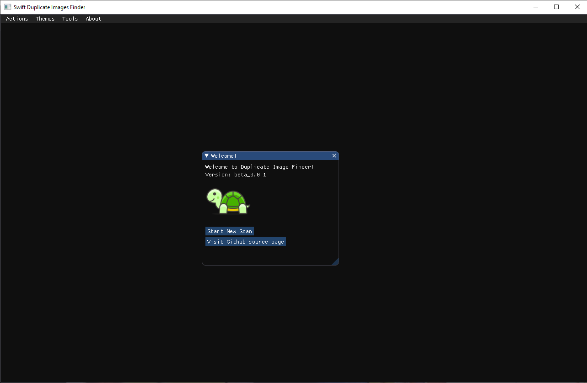
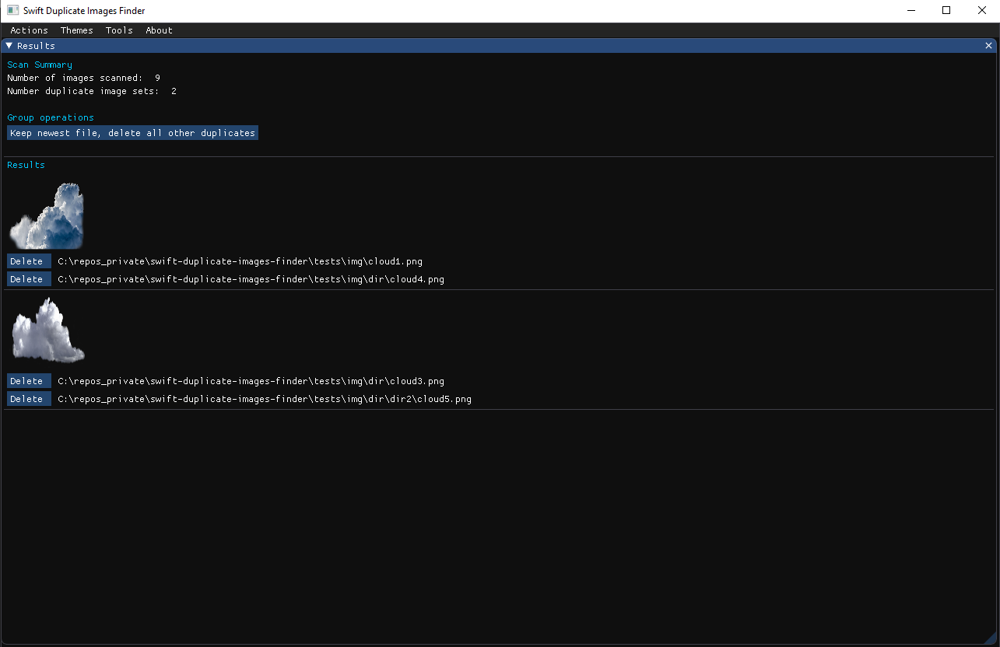

# Swift Duplicate Images Finder


## Brief

Swift Duplicate Images Finder is simple application that can be used to detect duplicate images.



</br>

Scan directories for duplicated images and manage results.  
Operations can be performed on single images or on all duplicates at once.




</br>


## DearPyGui

Thanks the guys at [DearPyGui](https://github.com/hoffstadt/DearPyGui) project. Make sure to check out this great open-source Python GUI middleware project.

</br>


## Links

[DearPyGui Github page](https://github.com/hoffstadt/DearPyGui)  
[DearPyGui Documentation](https://hoffstadt.github.io/DearPyGui/api_core.html)  
[DearPyGui Core API](https://github.com/hoffstadt/DearPyGui/blob/master/DearPyGui/dearpygui/core.pyi)  

</br>


## Development commands reference

Python virtual enviroment commands:
``` bash
python  -m venv venv
venv\Scripts\activate
venv\Scripts\deactivate
```

Python pip commands:
```bash
pip list
pip freeze > requirments.txt
pip install -r .\requirments.txt
```

Third party requirments:
``` bash
pip install dearpygui
pip install pyinstaller
```

</br>
